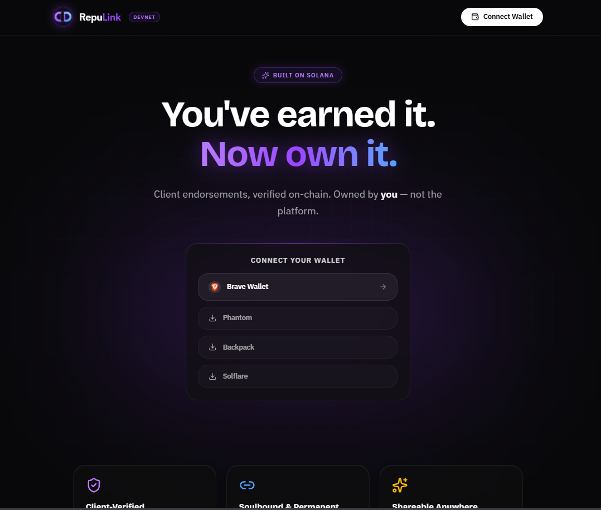

# RepuLink



> **Escrow for freelance work on Solana, with a portable reputation trail.**
> A client locks USDC in a program-owned vault, the freelancer delivers, and the
> funds are released against an on-chain state machine. Every settled job can be
> attested through the Solana Attestation Service, so the freelancer keeps a
> verifiable track record that no platform owns.

Built on **Solana** · Submitted to **WayLearn x Solana Foundation Hackathon 2026**

**Program ID (devnet):** [`2mMN1jtUGZo6j9Fmq46JUTJ7639bV1aEvTXoxtu4ZtH1`](https://explorer.solana.com/address/2mMN1jtUGZo6j9Fmq46JUTJ7639bV1aEvTXoxtu4ZtH1?cluster=devnet)

---

## Why

Freelancers get paid on trust: either they work first and hope the client pays,
or the client pays first and hopes the work arrives. Platforms solve this with
custodial escrow, and charge for it — and the reputation you build stays locked
inside the platform.

RepuLink puts the escrow in a program and the reputation in an attestation.
Neither party custodies the other's money, and the outcome of every job is a
public, verifiable record tied to the freelancer's wallet.

---

## The escrow flow

```
  client                        program                      freelancer
    │                              │                              │
    │  create_job ────────────────►│  Created                     │
    │  fund_job (USDC → vault) ───►│  Funded                      │
    │                              │◄──────── mark_delivered ─────│
    │                              │  Delivered                   │
    │                              │  review window starts        │
    │                              │                              │
    │  approve_release ───────────►│  Released  (fee → treasury,  │
    │                              │             rest → freelancer)│
    │                              │                              │
    │                              │◄──────── claim_timeout ──────│
    │                              │  Released, once the review   │
    │                              │  window has elapsed          │
    │                              │                              │
    │  cancel_refund ─────────────►│  Refunded (full amount back, │
    │  (only before delivery)      │            no fee)           │
    │                              │                              │
    │  open_dispute ──────────────►│  Disputed ◄─── open_dispute ─│
    │                              │      │                       │
    │                              │      ▼                       │
    │                              │  resolve_dispute (arbiter)   │
    │                              │  Resolved — split payout     │
```

### States

`Created` → `Funded` → `Delivered` → `Released`, with `Refunded` (cancelled
before delivery) and `Disputed` → `Resolved` as the alternative terminals.
Every transition is guarded by an explicit state check and a signer check; the
tests below cover the invalid transitions and the role-swap attempts.

### Rules enforced on-chain

| Rule                                                      | Where                                                                                                   |
| --------------------------------------------------------- | ------------------------------------------------------------------------------------------------------- |
| Client and freelancer cannot be the same wallet           | `create_job` — `SelfDealingNotAllowed`                                                                  |
| Amount must be non-zero                                   | `create_job` — `InvalidAmount`                                                                          |
| Review window must be 1–30 days                           | `create_job` — `InvalidReviewWindow`                                                                    |
| The fee the client signs for must match `Config`          | `create_job` — `fee_bps_snapshot` is compared against `config.fee_bps`, then frozen into the `Job`      |
| Fee is capped at 5% (`MAX_FEE_BPS = 500`)                 | `init_config` / `update_config` — `FeeTooHigh`                                                          |
| Only the client releases or cancels                       | `approve_release`, `cancel_refund`                                                                      |
| Only the freelancer marks delivered or claims the timeout | `mark_delivered`, `claim_timeout`                                                                       |
| Only the `Config` arbiter resolves a dispute              | `resolve_dispute`                                                                                       |
| Only the upgrade authority can call `init_config`         | `init_config` checks `ProgramData.upgrade_authority_address` — prevents front-running the global config |
| Vault substitution is rejected                            | the vault is the ATA of the `Job` PDA; constraints re-derive it                                         |

**Fees.** `fee_bps` is copied from `Config` into the `Job` at creation, so a
later `update_config` never changes the economics of a job already in flight.
On release, the fee goes to the treasury's token account and the remainder to
the freelancer. On a dispute, the fee applies only to the arbiter-assigned
`freelancer_amount`; the client's share is returned untouched.

**Two things to be precise about**, because the names invite the wrong reading:

- **The review window is not an auto-release.** Nothing executes on its own —
  Solana has no scheduler. When the window elapses, `claim_timeout` becomes
  available and the _freelancer_ must send it. Before that it fails with
  `ReviewWindowNotElapsed`. The default the UI proposes is 7 days; the program
  accepts anything from 1 to 30 days per job.
- **A timeout pays the freelancer; it does not refund the client.** The refund
  path is `cancel_refund`, which the client can only use _before_ delivery
  (`Created` or `Funded`) and which returns the full amount with no fee.

---

## Disputes and the arbiter

Either party can call `open_dispute` while funds are in escrow (`Funded` or
`Delivered`). The job freezes until the arbiter calls `resolve_dispute` with a
`freelancer_amount`, which splits the vault three ways: fee to the treasury,
`freelancer_amount - fee` to the freelancer, and the remainder to the client.

**The arbiter is a single `Pubkey` stored in `Config`.** The program has no
multisig logic of its own — it checks one signature, from whichever key the
admin set. That is the current honest state of the code, and it is the main
centralisation caveat of this MVP.

The intended path to decentralise it does not require a program change: any
address that can sign a CPI works as the arbiter, so pointing `Config.arbiter`
at a Squads v4 multisig vault would give 2-of-3 human arbitration without
touching the state machine. That is deliberately **not** done yet — Squads v4 is
scoped to mainnet in [`SPEC_escrow_mvp.md`](./SPEC_escrow_mvp.md), and on devnet
the arbiter is a plain keypair. Treat "2-of-3 arbitration" as roadmap, not as a
shipped property.

---

## On-chain vs off-chain

### On-chain

|              |                                                                                                                                                                                                                          |
| ------------ | ------------------------------------------------------------------------------------------------------------------------------------------------------------------------------------------------------------------------ |
| `Config` PDA | seeds `["config"]` → [`CiFqmrZiASJMFsfXv9RfVe2Eb6Eq2h62XXNwxKAc8xSv`](https://explorer.solana.com/address/CiFqmrZiASJMFsfXv9RfVe2Eb6Eq2h62XXNwxKAc8xSv?cluster=devnet). Holds `admin`, `arbiter`, `treasury`, `fee_bps`. |
| `Job` PDA    | seeds `["job", client, job_id]` (`job_id` little-endian `u64`). Holds both parties, the arbiter and fee snapshots, amounts, timestamps, state, and the two hashes.                                                       |
| Vault        | the associated token account owned by the `Job` PDA. Funds only ever move through SPL Token CPIs signed by the PDA.                                                                                                      |
| Events       | `JobCreated`, `JobFunded`, `JobDelivered`, `JobReleased`, `JobRefunded`, `JobDisputed`, `JobResolved`.                                                                                                                   |
| Attestations | Solana Attestation Service (see below).                                                                                                                                                                                  |

Money never touches a wallet the protocol controls: the vault is a PDA-owned
ATA, and every transfer is a CPI to the official SPL Token program. There is no
hand-rolled balance arithmetic.

### Off-chain

|                      |                                                                                                                                     |
| -------------------- | ----------------------------------------------------------------------------------------------------------------------------------- |
| The brief            | Only `terms_hash` — SHA-256 of the agreed scope — is stored. The text itself lives wherever the parties agreed.                     |
| The delivery         | Only `delivery_hash` — SHA-256 of the delivered artifact or its URL — is written by `mark_delivered`.                               |
| Attestation issuance | `scripts/attest-job.ts`, run by the RepuLink authority after a job settles. Not automatic, and not part of the release transaction. |
| RPC                  | Helius (or any RPC) for reads. No indexer, no backend, no database.                                                                 |

Hashes are commitments, not storage: the program can prove _which_ brief was
agreed if someone produces it, but it cannot show you the brief.

---

## Attestations (SAS)

When a job reaches a terminal state — `Released`, `Refunded` or `Resolved` — it
can be attested through the [Solana Attestation Service](https://attest.solana.com)
(`22zoJMtdu4tQc2PzL74ZUT7FrwgB1Udec8DdW4yw4BdG`).

```bash
npm run sas:attest-job -- <job-address>
```

|            |                                                                    |
| ---------- | ------------------------------------------------------------------ |
| Authority  | `HtvQNd9Ngm8q6HU4X9Uyq4V5DXzzQ8bARsYfeDYRTkY1`                     |
| Credential | `J9ExNHgiyzVV7hduaeSL1wyyHz2vYgg7hcpeeWUcCgJg` (`RepuLink`)        |
| Schema     | `A779c2vvVWv7vEe3sKsK2zGTKveAJwFDwbCxAnCYfAhc` (`repulink-job` v1) |
| Fields     | `job`, `state`, `created_at`, `resolved_at`                        |

The attestation nonce is the Job PDA, so each job maps to exactly one
deterministic attestation address — discoverable by derivation, with nothing to
index. Before signing, the script verifies that the account is owned by the
RepuLink program, carries the `Job` discriminator, and matches the PDA
re-derived from `(client, job_id)`; `resolved_at` comes from the block time of
the job's last transaction rather than the local clock.

The signing key is held by RepuLink — this is an issuer-attested record, not a
trustless one. It lives in `~/.repulink/`, **outside the repository**, and can
be relocated with `SAS_AUTHORITY_KEY_PATH`. Only the bootstrap script may create
it; the attestation service refuses to run if it is missing rather than silently
minting a new trust root.

---

## Tech stack

**On-chain** — Rust, Anchor 0.32.1, `anchor-spl` for SPL Token and ATA CPIs.

**Client** — React 19 + Vite + TypeScript, TailwindCSS 4,
[`@solana/kit`](https://github.com/anza-xyz/kit) with `@solana/react-hooks` for
wallet and transaction handling, and [Codama](https://github.com/codama-idl/codama)
to generate the typed program client from the IDL. No hand-written instruction
encoding.

---

## Getting started

### Prerequisites

Node.js 18+, Rust + Cargo, Solana CLI, Anchor CLI.

### 1. Install

```bash
git clone https://github.com/YhonaPeguero/RepuLink.git repulink
cd repulink
npm install
```

### 2. Environment

```bash
cp .env.example .env
```

```env
VITE_HELIUS_RPC_URL=https://devnet.helius-rpc.com/?api-key=your_helius_api_key
VITE_USDC_MINT=4zMMC9srt5Ri5X14GAgXhaHii3GnPAEERYPJgZJDncDU
```

Only these two. The program ID ships inside the generated client
(`src/generated/repulink`) and is not configurable at runtime. Get a Helius key
at [dashboard.helius.dev](https://dashboard.helius.dev).

`VITE_USDC_MINT` is any SPL mint with 6 decimals — devnet USDC from Circle's
faucet, or a test mint you control.

### 3. Build the program and regenerate the client

```bash
npm run setup          # anchor build + codama
```

### 4. Run

```bash
npm run dev            # http://localhost:5173
```

---

## Tests

15 integration tests run against [LiteSVM](https://github.com/LiteSVM/litesvm) —
no validator, no deploy, under a second end to end.

```bash
cd anchor
cargo build-sbf        # LiteSVM loads target/deploy/repulink.so
cargo test
```

**Escrow (11)** — happy path with exact balance assertions; `claim_timeout`
after warping past the review window; refund before delivery and its rejection
after; dispute resolved with a split; strangers rejected on every instruction;
roles unable to swap instructions; `create_job` input validation including
self-dealing; vault substitution rejected; invalid state transitions rejected;
config admin-gated and fee-capped.

**Badges (4)** — the legacy profile/endorsement module (see below).

The fee assertions deliberately use an amount that does not divide evenly by the
fee (`1_000_001` at 150 bps) so truncation is pinned down rather than assumed.

### End-to-end on devnet

Exercises the same instructions the UI sends, against the deployed program:

```bash
npx tsx scripts/e2e-escrow.ts
```

Requires `~/.config/solana/id.json` funded with devnet SOL — it must be the
program's upgrade authority if `Config` has not been initialised yet. The script
creates its own 6-decimal test mint, runs the full happy path (create + fund
atomically → deliver → release, asserting the fee split), then a dispute
resolved 50/50, and prints Explorer links for every transaction.

Transactions are confirmed by polling `getSignatureStatuses` instead of
WebSocket subscriptions, which hang on the public devnet RPC.

---

## Project structure

```
repulink/
├── anchor/programs/repulink/
│   ├── src/lib.rs              ← instruction handlers
│   ├── src/escrow.rs           ← escrow accounts, contexts, events, payout helpers
│   └── tests/{escrow,badges}.rs← LiteSVM integration tests
├── scripts/
│   ├── e2e-escrow.ts           ← devnet end-to-end
│   ├── sas.ts                  ← SAS authority, credential, schema
│   └── attest-job.ts           ← issue an attestation for a settled job
└── src/
    ├── pages/                  ← CreateJobPage, JobPage, Dashboard, PublicProfile…
    ├── hooks/useEscrow.ts      ← builds and sends every escrow instruction
    ├── lib/                    ← PDA derivation, confirmation, error mapping
    └── generated/repulink/     ← Codama client (generated, do not edit)
```

---

## Legacy: the endorsement module — deprecated, out of review scope

The program still exports `initialize_profile`, `create_badge`, `approve_badge`,
`reject_badge`, `update_profile` and `close_profile` from an earlier iteration
where clients endorsed freelancers directly, with routes still wired at
`/badge/create` and `/approve/:freelancer/:badgeIndex`. It is independent of the
escrow: it shares no accounts with `Job` or `Config`.

**It is deprecated, and it is not part of what we are asking reviewers to look
at.** It is documented here only so that a reviewer reading `lib.rs` knows why
those instructions exist.

The reason it was replaced is a design flaw, not a bug: **nothing ties the
approver to any real work.** In the `ReviewBadge` context the reviewer is an
unconstrained `Signer`, and the freelancer is an `UncheckedAccount` used only to
derive the badge PDA. So:

- Any wallet can approve any pending badge, and `approve_badge` records whoever
  signed as `client_wallet` — the "client identity" on the badge is simply
  whoever sent the transaction.
- Nothing stops a freelancer from approving their own badge.
- Symmetrically, any wallet can `reject_badge` on someone else's pending badge.

A signature proves only that _someone_ signed. It cannot prove a working
relationship, so the endorsements it produces are not worth much as reputation.

The escrow fixes this at the root: approval authority is derived from having put
money in the vault. `approve_release` requires `signer.key() == job.client`, and
the client is the wallet that funded the job. An endorsement is no longer a
claim someone makes — it is a side effect of a payment that actually happened.

---

## Known limitations

- **Single-key arbiter.** Disputes resolve on one signature. See above.
- **Attestations are issuer-signed.** A trusted RepuLink key vouches for job
  outcomes; it is not derived trustlessly from chain state.
- **Devnet only, unaudited.** No mainnet deployment and no third-party audit.
- **`claim_timeout` requires an active freelancer.** If neither party acts after
  delivery, funds stay in the vault indefinitely.

---

## Built with

[Solana](https://solana.com) · [Anchor](https://anchor-lang.com) ·
[Solana Attestation Service](https://attest.solana.com) ·
[Helius](https://helius.dev) · [Codama](https://github.com/codama-idl/codama) ·
[LiteSVM](https://github.com/LiteSVM/litesvm) · [WayLearn](https://waylearn.io)

---

## License

MIT — see [LICENSE](./LICENSE).

---

_RepuLink — Solana LATAM Hackathon 2026 by [Yhona Peguero](https://www.linkedin.com/in/yhonatan-peguero/)_
